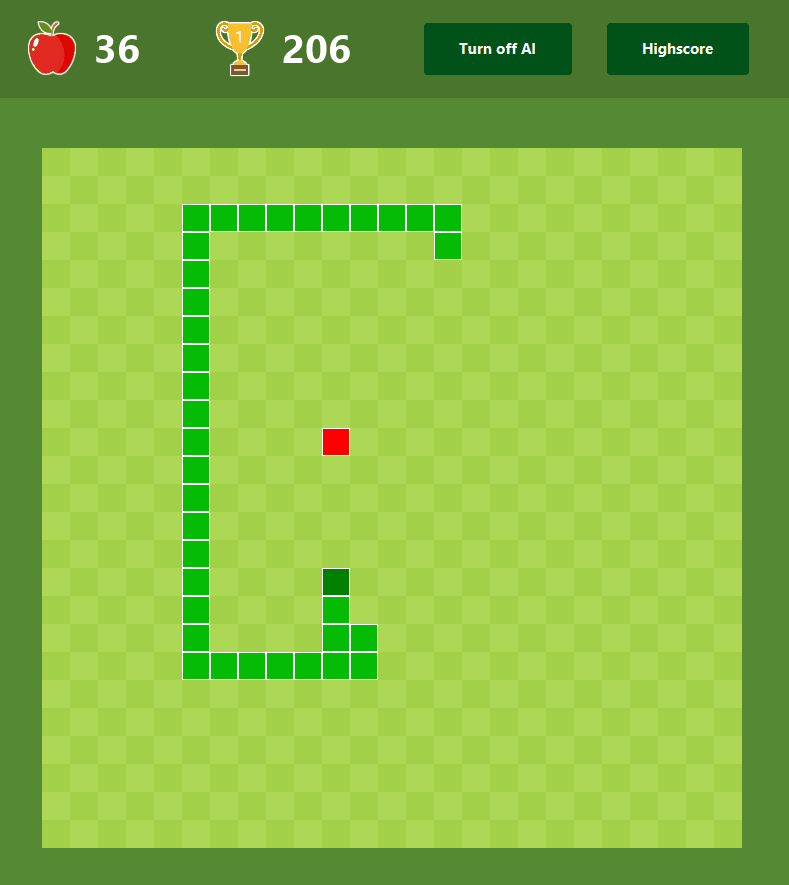
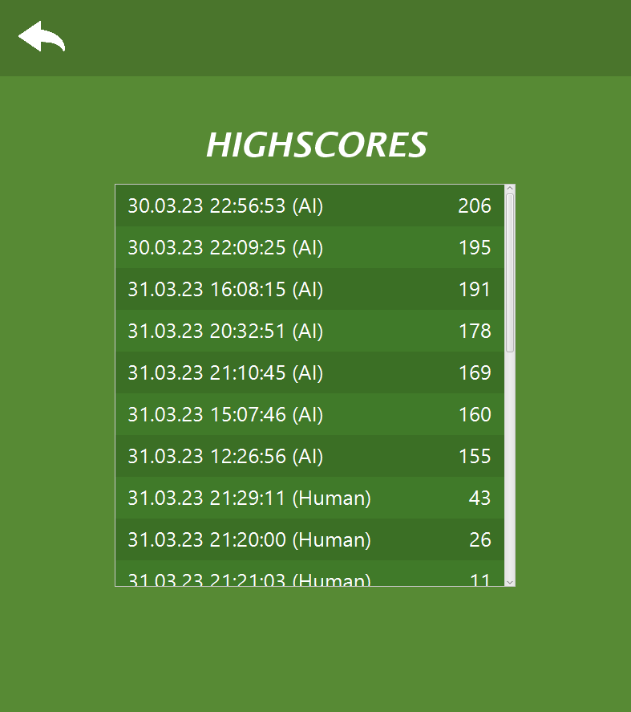

# TDT4100 - Project

This repository is related to a project for [TDT4100 - Object Oriented Programming](https://www.ntnu.no/studier/emner/TDT4100)

## Project description

This project creates the classic video game Snake. In addition I created a Snake AI, which uses an self-created algorithm to control the snake's movement based on looking certain moves ahead, and deciding the optimal move.  
The UI and color choices are inspired by Google's Snake.   
Short description about Snake:  
Snake is a classic game in which the player controls a growing snake as it moves around a confined space, such as a grid. The objective of the game is to eat as many randomly placed apples as possible without colliding with the walls or the snake's own body. As the snake consumes more objects, it grows in length, making it more challenging to avoid obstacles and navigate the playing field. The game continues until the snake collides with a wall or its own body, at which point the player loses and must start again from the beginning.

## How to play

Run the main method in the [App Application](src/main/java/Snake/App.java). Then a 800x800 window opens. To start playing, press WASD or the arrow buttons, and the snake will move in the corresponding direction. If you would want to pause the game, press SPACE. The game will continue until you collide with the walls or youself. Then a Game Over screen will appear, which will display your score and the highscore. To continue playing, do the same as you initially did to start playing, in other words press WASD or the arrow buttons.  

## Logic and structure

### Structure

This project follows the [Model](src/main/java/Snake/Model/)-[View](src/main/java/Snake/View/)-[Controller](src/main/java/Snake/Controller/) (MVC) design pattern.
The game logic is seperated into the [Model folder](src/main/java/Snake/Model/), and operate independently of the View and Controller, and therefore has no knowledge of the View's existence. It does however know about an [interface](src/main/java/Snake/Controller/ControllerListener.java) of the controller, which is used to implement the Observer-Observable pattern. Additionally, there is a [Utilities](src/main/java/Snake/Utils/) folder, containing various global classes and data types.

### Input handling

The [controller](src/main/java/Snake/Controller/FXMLController.java) handles receiving keyboard inputs, and calls the corresponding method in the model.  
To handle directional inputs, I have created a custom [datatype/class](src/main/java/Snake/Model/DirectionDefaultList.java), which is able to obtain multiple inputs on the same frame. The Queue interface served as a source of inspiration, but it has inherited the List interface because the final element is often retrieved. Every time an input is received, it is appended to the list. If the same input is received consecutively, only one instance is added to prevent accumulation of duplicates. Additionally, a default value is included to ensure that the datatype is never empty.'

### Rendering
The rendering method in the [view](src/main/java/Snake/View/GameView.java) has been through many iterations to optimize and speed up the game. 
The rendering method can be divided into two parts: Initialization (Initial frame of the game) and Ongoing Rendering.  

Initialization:  
The first iteration of the initial frame was the naive double loop, which draw each small square individually. Later I optimized it to draw one large square followed by smaller squares on top, leading to a reduction of over fifty percent in the number of drawing calls required.   
To give some data to the improvements:  
Before: 20 seconds to initialize a 1000x1000 grid  
After: 0.05 seconds to initialize a 1000x1000 grid  
The optimized method uses the same time to create a 7000x7000 grid as the naive used on a 1000x1000 grid (x49 as many squares).   

Ongoing rendering:  
Initially the game could only handle a 100x100 grid with 20 fps (with flickering). This was the naive method of redrawing the whole canvas on each frame, which resulted in poor performance. The optimized method bases itself on the previous frame, and only redraws the difference. Since there are at max only 4 squares which have changed (1 for snake's head, 2 for snake's body, 1 for apple), we would only redraw at max 4 squares.
This gives an enormous performance boost, as where we previously drew 10000 squares (in a 100x100 grid), we now only draw max 4 squares. The numbers of draw calls can therefore be described as an improvement from O(n2) to O(1).   

Combined, these optimizations enable one to play on a 4000x4000 grid without any performance issues. In tests, the initialization process took 3 seconds, and the game ran at over 1000 frames per second.

## File handling
Lorem ipsum dolor sit amet

## Snake class
*How the snake is constructed*

## Snake AI
The implementation of an algorithm that plays snake, is done by extending already implemented logic, and therefore work on top of the existing game. The [`GameAI`](src/main/java/Snake/Model/AI/GameAI.java) class is created by extending the [`Game`](src/main/java/Snake/Model/Game.java) class and overriding its `update()` method. When the snake has no more directions to move, we invoke the `AINextMove` static method from the [`SnakeAI`](src/main/java/Snake/Model/AI/SnakeAI.java) class. This then returns a list of directions, which we use to update the original Snake object's list of directions. The `GameAI`'s update method continues with calling the superclass' update method, in other words, `Game`'s update method.
 
 
The `SnakeAI` class is comprised solely of static methods. The primary method, `AINextMove`, takes the Snake object and returns the list of best possible moves. The AI algorithm works by looking several moves into the future, and deciding the optimal move to ensure its survival and fulfulling its goal of eating an apple. Recursion is employed to explore future moves, and the `AINextMoveRecursion` method generates a list of all possible moves the Snake could take. The `AINextMove` method then uses this list along with a set of instructions to determine the optimal list of moves. An important factor in selecting the optimal move, is to get the available space for the snake to move in. If a particular move results in a significantly smaller area, then that move would be de-prioritized. The flood fill algorithm is utilized to obtain the available space.
To further enhance performance, the AI's recursion method now utilizes multithreading.

## Class diagram

## Images of the game

